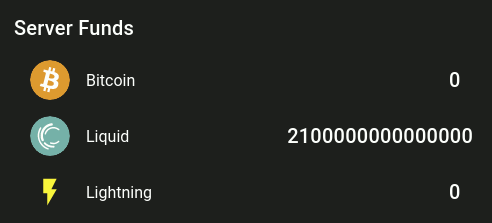

## Fund Coinos server (via bitcoin-cli)

Bitcoin Regtest Mode allows us to create our own Bitcoin sandbox blockchain for use in testing & development. 


From the coinos-server dir on your localfilesystem (ie- after following the 'Getting Started' section of our [root README]) 

```bash

docker exec -it bitcoin bash

# get an address
bitcoin-cli -regtest -rpcuser=admin1 -rpcpassword=123 getnewaddress
> bcrt1qzneawwyxe0fts5p8a6tsp4gu2mfnqzs92235hm # (example)

# mine a block to the new address 
bitcoin-cli -regtest -datadir=/config generatetoaddress 101  theaddressgeneratedabove

# verify you got the reward by doing: 
bitcoin-cli -regtest -rpcuser=admin1 -rpcpassword=123 getbalance
> 50.00000000

# send 10 bitcoin to a coinos wallet account you created
# (get the address to send to from ./receive, select 'Bitcoin')
bitcoin-cli -regtest -rpcuser=admin1 -rpcpassword=123 sendtoaddress [account-address] 10

# confirm the transaction
# (do the mining command again)
bitcoin-cli -regtest -rpcuser=admin1 -rpcpassword=123 generatetoaddress 101 theoriginaladdressgeneratedabove
```




#### further reading

On why to generate 101 blocks and some general info on Regtest Mode: 

https://developer.bitcoin.org/examples/testing.html


[root README]:https://github.com/coinos/coinos-server

